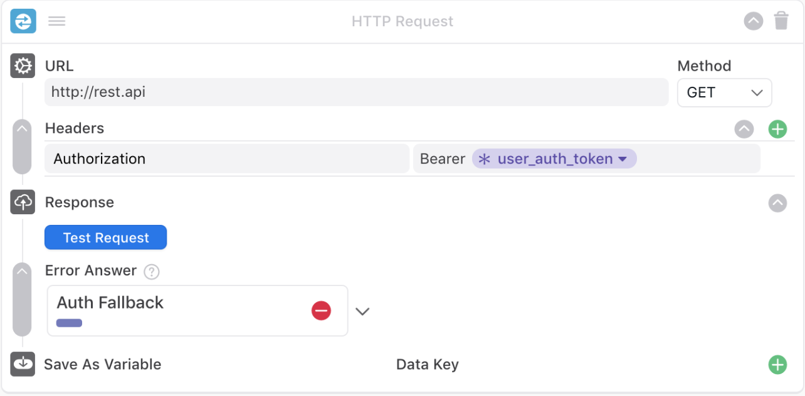

# Pre-Authenticated Users In Ada

> This article will outline how to implement Ada’s Authentication functionality for your customers who are already logged in to your services on either a webpage, desktop application, or mobile application. Once enabled, a user who is already logged in to their account on your website, mobile app, or desktop app, will not be asked by the bot to log in again mid-conversation.

> The core difference between this article and the original Authentication article is that this version does not leverage the Sign In blocks. Instead, this method of authentication relies on some simple Auth Token and/or Session ID generation. 

## Table of Contents

There are two different methods for achieving this. 

1. [Method 1 - Unique User Authentication Token Generation] (#method-1)

Generating unique user authentication tokens, is recommended if you have this capability. If this functionality is not available for you, then we have provided an alternate option.

2. [Method 2 - Setting a Session ID with Expiration Timer] (#method-2)

Setting session IDs with an expiration timer. Instructions for establishing both of these methods are available below.

## Method 1
### Passing a Unique User Authentication Token

*This method assumes that your backend uses tokens to authenticate users.
Furthermore, the instructions below are written for pre-authentication on the web. The process may look slightly different for mobile or desktop applications, however, the concepts and outcomes remain the same.

In this section, we explain how to create a unique authentication token for each user, and pass this token to us. As you proceed through the steps below you will be working to create a purple metavariable, similar to the one seen here:*


Detailed instructions on how to Set MetaFields in Ada are included in the [Ada Embed] (#ada-embed) documentation. 

*See the relevant snippet below.*

#### `setMetaFields(metaFields)` `@param {Object}`
Used to update `metaFields` after Chat has been opened. In most situations, the [metaFields](#metafields-type-object) settings object should be enough for user attribution. However, in cases where Ada Chat remains open while page changes occur (like in Single Page Applications), this methods may be useful.

**Example:**
```javascript
adaEmbed.setMetaFields({
  phone_number: "(123) 456-7890",
  name: "Ada Lovelace"
});
```
**Note:** Please keep in mind the following: 1) Because unsanitized meta variable names are sanitized by Ada's backend, meta variable names should not include whitespace, emojis, special characters or periods; 2) Some default meta variables are already set for you.

## Using the Authentication Token to unlock APIs



Once this HTTP Request block is set up (as seen above) and is triggered in an Answer Flow, this authentication token is passed to the API. It is assumed that the token authenticates the calls to the API, **therefore, the token verification should happen in the backend on every call,**  thus allowing the API to authenticate the user, and continue to execute the request.

**Note:** this Authentication Token *does not* need to be the same token that is used to authenticate users on your site. If your team wishes, they may generate new credentials exclusively for Ada - which can possess limited information.

## Method 2
### Passing an Expiring Session ID to Ada

*Please note: This method assumes that it is not possible to create a unique authentication token for each user. 

Furthermore, the instructions below are written for pre-authentication on the web. The process may look slightly different for mobile or desktop applications, however, the concepts and outcomes remain the same.*

As you proceed through the steps below you will be working to create a purple metavariable, similar to the one seen here:


For security purposes, we recommend setting an expiration on the session ID that will force the session ID to be regenerated every X minutes. Learn more about best standards with OAuth 2.0 Access Token Lifetimes: [here.] (https://www.oauth.com/oauth2-servers/access-tokens/access-token-lifetime/)

Below is an example of how one would get a new refreshed session ID and pass it to Ada. Please note that the backend is expected to take care of the session ID expiry. This code snippet was used for a web-based JavaScript application and may look different according to the application type and coding languages, however, the concepts remain the same.


